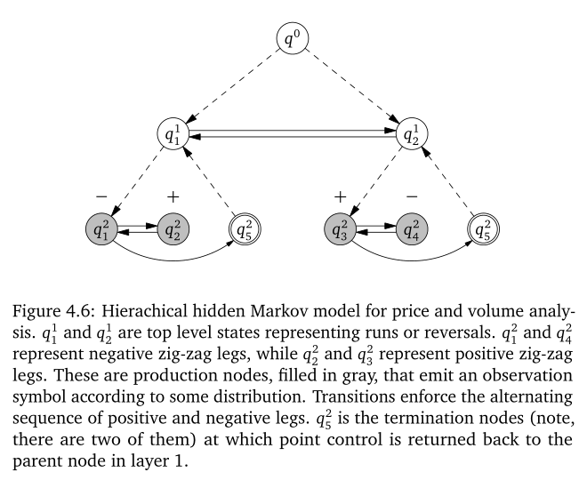
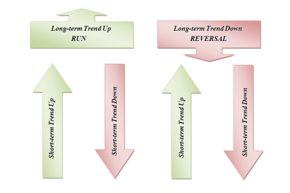

```{r setup, include=FALSE}
knitr::opts_chunk$set(echo = TRUE, cache = TRUE, fig.width = 7.2)
```

```{r echo = FALSE, results="asis"}
cat("<style>img{border: 0px !important;}</style>")
```

This work aims at ... .

The authors acknowledge Google for financial support via the Google Summer of Code 2017 program.

---

# Hierarchical Hidden Markov Models

The Hierarchical Hidden Markov Model (HHMM) is a recursive hierarchical generalization of the HMM that provides a systematic unsupervised approach for complex multi-scale structure. The model is motivated by the multiplicity of length scales and the different stochastic levels (recursive nature) present in some sequences. Additionally, it infers correlated observations over long periods via higher levels of hierarchy.

The model structure is fairly general and allows an arbitrary number of activations of its submodels. The multi-resolution structure is handled by temporal experts^[In Machine Learning terminology, a problem is divided into homogeneous regions addressed by an expert submodel. A gating network or function decides which expert to use for each input region.] of different time scales.

## Model specification
HHMM are structured multi-level stochastic processes that generalize HHM by making each of the hidden states an autonomous probabilistic model. There are two kinds of states: internal states are HHMM that emit sequences by a recursive activation of one of the substates, while production states generate an output symbol according to the probability distribution of the set of output symbols.

Hidden dynamics are lead by transitions. Vertical transitions involve the activation of a substate by an internal state, they may include further vertical transitions to lower level states. Once completed, they return the control to the state that originated the recursive activation chain. Then, a horizontal transition is performed. Its state transition within the same level.

A HHMM can be represented as a standard single level HMM whose states are the production states of the corresponding HHMM with a fully connected structure, i.e. there is a non-zero probability of tranisition from any state to any other state. This equivalent new model lacks the multi-level structure.

Let $z_{t}^{d} = i$ be the state of an HHMM at the step $t$, where $i \in \{1, \dots, |z^{d}|\}$ is the state index, $|z^{d}|$ is the number of possible steps within the $d$-th level and $d \in \{1, \dots, D\}$ is the hierarchy index taking values $d = 1$ for the root state, $d = \{2, \dots, ..., D-1\}$ for the remaining internal states and $d = D$ for the production states.

In addition to its structure, the model is characterized by the state transition probability between the internal states and the output distribution of the production states. For each internal state $z_t^d$ for $d \in \{1, \dots, D - 1\}$, there is a state transition probability matrix $\mat{A}^d$ with elements $A_{ij}^{d} = p(z_{t}^{d+1} = j | z_{t}^{d+1} = j)$ is the probability of a horizontal transition from the $i$-th state to the $j$-th state within the level $d$. Similarly, there is the initial distribution vector over the substates $\mat{\pi}^d$ with elements $\pi_j^d = p(z_t^{d+1} = j | z_t^d)$ for $d \in \{1, \dots, D - 1\}$. Finally, each production state $z_t^D$ is parametrized by the output parameter vector $\mat{\theta}_o^i$ whose form depends on the specification of the observation model $p(\mat{x}_t | z_t^D = j, \mat{\theta}_o^j)$ corresponding to the $j$-th production state.

## Generative model

The root node initiates a stochastic sequence generation. An observation for the first step in the sequence $t$ is generated by drawing at random one of the possible substates according to the initial state distribution $\mat{\pi}^1$. To replicate the recursive activation process, for each internal state entered $z_t^d$ one of the substates is randomly chosen according to the corresponding initial probability vector $\mat{\pi}^d$. When an internal state transitions to a production state $z_t^D = j$, a single observation is generated according to the state output parameter vector $\mat{\theta}_o^j$. Control returns to the internal state that lead to the current production state $z_t^{D-1}$, which in turns selects the next state in the same level according to transition matrix $\mat{A}^{D-1}$.

Save for the top, each level $d \in \{2, \dots, D\}$ has a final state that terminates the stochastic state activation process and returns the control to the parent state of the whole hierarchy. The generation of the observation sequence is completed when control of all the recursive activations returns to the root state.

## Parameter estimation

The parameters of the models are $\mat{\theta} = \left\{ \left\{ \mat{A}^d \right\}_{d \in \{1, \dots, D - 1\}}, \left\{ \mat{\pi}^d \right\}_{d \in \{1, \dots, D - 1\}}, \left\{ \mat{\theta}_o \right\} \right\}$. The form of $\mat{\theta}_o$ depends on the specification of the production states.

## Inference
There are several quantities of interest to be estimated via different algorithms. In this section, the discussion assumes that model parameters are known.

### Filtering

...

### Smoothing

...

### Most likely hidden path

...

## Parameter estimation

...

---

# Regime Switching and Technical Trading with Dynamic Bayesian Networks in High-Frequency Stock Markets

## Preamble

...

## Feature extraction

### Input series

Tick series are a sequence of triples $\{y_k\}$ with $y_k = (t_k, p_k, v_k)$, where $t_k \le t_{k+1}$ is the time stamp in seconds, $p_k$ is the trade price and $v_k$ is the trade volume. The sequence is ordered by the occurence of trades. There can be more than one trade within a second.

As proposed by @tayal2009, we derive zig-zags that capture the bid-ask bounce $\{z_k\}$ with $z_k = (i_n, j_n, e_n, \phi_n)$, where $i_n \le i_j$ are indices to the tick series representing the starting and ending point of the extrema, $e_n = p_k \forall \ k : i_n \le k \le j_n$ is the price at the local extrema, and $\phi_m$ measures the average volume per second during the zig-zag leg ending at $e_n$:

\[
\phi_n = \frac{1}{t_{j_n} - t_i_{n-1} + 1} \sum_{k = i_{n-1}}^{j_n}{v_k}.
\]

We note that $p_{i_n} < e_n < p_{j_n + 1}$ for local maxima and $p_{i_n} > e_n > p_{j_n + 1}$ for local minima. The average volume, which includes the end-point extrema, is normalized by $t_{j_n} - t_i_{n-1} + 1$ to avoid division by zero when the zig-zag leg occurs within the same time period. Most importantly, we underline that the $n$-th zig-zag point $z_n$ is realized only after observing the $(j_n + 1)$-th tick point $y_{j_n + 1}$. The one tick lag between leg completion and the time of detection should be carefully considered to avoid look-ahead bias in out of sample.

### Processing rules

Discrete features are created based on the zig-zag series $\{z_n\}$. We first create an auxiliary series $\{O_n\}$ with $O_n = (f_n^0, f_n^1, f_n^2)$, where $f_n^0$ represents the direction of the zig-zag, $f_n^1$ indicates the existence of a trend and $f_n^2$ indicates whether average volume increased or decreased.

Formally,

\[
f_n^0 =
\begin{cases}
+1 & \text{if $e_n$ is a local maximum (positive zig-zag leg)} \\
-1 & \text{if $e_n$ is a local minimum (negative zig-zag leg),} \\
\end{cases}
\]

and

\[
f_n^0 =
\begin{cases}
+1 & \text{if $e_{n-4} < e_{n-2} < e_{n} \wedge e_{n-3} < e_{n-1}$ (up-trend)} \\
-1 & \text{if $e_{n-4} > e_{n-2} > e_{n} \wedge e_{n-3} > e_{n-1}$ (down-trend)} \\
 0 & \text{otherwise (no trend).}
\end{cases}
\]

For the third indicator function, we compute the average volume ratios,

\[
\nu_n^1 = \frac{\phi_n}{\phi_{n-1}}, \quad \nu_n^2 = \frac{\phi_n}{\phi_{n-2}}, \quad \nu_n^1 = \frac{\phi_{n-1}}{\phi_{n-2}},
\]

we transform the ratios into a discrete variable using an arbitrary threshold $alpha$,

\[
\tilde{\nu}_n^j =
\begin{cases}
+1 & \text{if $\nu_n^j - 1 > \alpha$} \\
-1 & \text{if $1 - \nu_n^j > \alpha$} \\
 0 & \text{if $|\nu_n^j - 1| \le \alpha$}, \\
\end{cases}
\]

and we finallly define

\[
f_n^2 =
\begin{cases}
+1 & \text{if $\tilde{\nu}_n^1 = 1, \tilde{\nu}_n^2 > -1, \tilde{\nu}_n^3 < 1$ (volume strengthens)} \\
-1 & \text{if $\tilde{\nu}_n^1 = -1, \tilde{\nu}_n^2 < -1, \tilde{\nu}_n^3 > -1$ (volume weakens)} \\
 0 & \text{otherwise (volume is indeterminant)}. \\
\end{cases}
\]

The features are then creased using the following table.

| Feature           |          $U_1$ |          $U_2$ |           $U_3$ |          $U_4$ |            $U_5$ |      $U_6$ |           $U_7$ |       $U_8$ |         $U_9$ |
|-------------------|---------------:|---------------:|----------------:|---------------:|-----------------:|-----------:|----------------:|------------:|--------------:|
| Zig-zag direction |     Upwards +1 |     Upwards +1 |      Upwards +1 |     Upwards +1 |       Upwards +1 | Upwards +1 |      Upwards +1 |  Upwards +1 |    Upwards +1 |
| Price trend       |    Up-trend +1 |  Down-trend -1 |     Up-trend +1 |     No trend 0 |       No trend 0 | No trend 0 |   Down-trend -1 | Up-trend +1 | Down-trend -1 |
| Change in volume  | Strengthens +1 | Strengthens +1 | Indeterminant 0 | Strengthens +1 |  Indeterminant 0 | Weakens -1 | Indeterminant 0 |  Weakens -1 |    Weakens -1 |
| Market state      |        Bullish |        Bullish |         Bullish |        Bullish | Local volatility |    Bearish |         Bearish |     Bearish |       Bearish |

| Feature           |        $D_1$ |         $D_2$ |           $D_3$ |          $D_4$ |            $D_5$ |          $D_6$ |           $D_7$ |          $D_8$ |          $D_9$ |
|-------------------|-------------:|--------------:|----------------:|---------------:|-----------------:|---------------:|----------------:|---------------:|---------------:|
| Zig-zag direction | Downwards -1 |  Downwards -1 |    Downwards -1 |   Downwards -1 |     Downwards -1 |   Downwards -1 |    Downwards -1 |   Downwards -1 |   Downwards -1 |
| Price trend       |  Up-trend +1 | Down-trend -1 |     Up-trend +1 |     No trend 0 |       No trend 0 |     No trend 0 |   Down-trend -1 |    Up-trend +1 |  Down-trend -1 |
| Change in volume  |   Weakens -1 |    Weakens -1 | Indeterminant 0 | Strengthens +1 |  Indeterminant 0 | Strengthens +1 | Indeterminant 0 | Strengthens +1 | Strengthens +1 |
| Market state      |      Bullish |       Bullish |         Bullish |        Bullish | Local volatility |        Bearish |         Bearish |        Bearish |        Bearish |

Table: Summary of feature space.

Based on 

@wisebourt2011hierarchical proposes a modification for the feature extraction procedure. By computing the spreed between the Volume Weighted Average Prices of the bid and the ask, he designs a book imbalance metric that describes the state of the order book at any given moment in time.

for the volume based on the ... Then, @xx proposes a two simple-smoothed exponential distance-weighted average volume series.

...

In the end, we arrive at a $L$-long feature vector space $\mat{O} = \left\{... \right\}$

## Model

We adhere to the methodology proposed in the original work as much as possible. We set up a HHMM to learn the sequence of discrete features extracted from a high-frequency time series of stock prices and traded volume. The figure below summarises the model structure in the form of a Dynamic Bayesian Network.

The graph starts with a root node $z^0$ that has two top-level children $z_1^1$ and $z_2^1$ representing bullish markets (or runs) and bearish markets (or reversals). The specifications do not pose any constraints to determine beforehand which node takes each of the possible two meanings. In consequence, latent states need to be labeled after the learning stage based on sample characteristics such as mean returns. Prior information, like parameter ordering, could be embedded to break symmetry and mitigate eventual identification issues.



Each top node activates a probabilistic HMM with two latent states for negative and positive zig-zag legs. The sub-model activated by the node $z_1^1$ always starts with the node $z_1^2$ producing an observation from the distribution of negative zig-zag $\mat{D} = \{D_1, \dots, D_9 \}$. Next, it transitions to (a) the node $z_2^2$ producing a positive zig-zag leg $\mat{U} = \{U_1, \dots, U_9 \}$, (b) the end node which may, in turn, transition back to $z_1^1$ emitting a new negative zig-zag leg, or (c) the end node and switches to the second sub-model, landing on node $z_3^2$ and producing a positive zig-zag leg. Restricting transitions to this limited set of movements force alternation between positive and negative zig-zag legs, thus guaranteeing that all possible observation sequences are well behaved. The sub-model belonging to $z_2^1$ has similar but symmetrical behaviour. These two inner models are conditionally independent, an advantage we will take for computational time.



Theoretically, all HHMM can be expressed as an equivalent HMM with possibly sparse initial probability vector and transition matrix. Although learning from this representation may prove less efficient in terms of computational complexity, the relatively simple structure and many restrictions of the model under study make estimation and inference feasible. The equivalent "expanded" HMM has the following initial probability vector

\[
\mat{\pi} = 
  \begin{bmatrix}
  \pi_1 & 0 & 1 - \pi_1 & 0 \\
  \end{bmatrix}
\]

and transition matrix

\[
\mat{A} =
  \begin{bmatrix}
    p_{11} & p_{12} & 1 - p_{11} - p_{12} & 0                   \\
    1      & 0      & 0                   & 0                   \\
    p_{31} & 0      & p_{33}              & 1 - p_{31} - p_{33} \\
    0      & 0      & 1                   & 0                   \\
  \end{bmatrix},
\]

where each element $p_{ij}$ represents the probability of transitioning from the hidden state $i$ (row) to $j$ (column) in one step. The matrix is sparse with zeros representing nodes with no direct connections. Since the initial probability vector and the rows of the transition matrix must sum to $1$, hidden dynamics are governed by only five free parameters.

Does this representation "lose" the hierarchical interpretation of the states? Do transition probabilities summarize all possible paths from one node to the other? In this case I believe there's a 1-to-1 map from the HHMM arrows to the HMM matrix.

Production nodes emit one observation from the finite sets of possible outputs $\mat{O}_D$ (for $z_1^2$ and $z_4^2$) and $\mat{O}_U$ (for $z_2^2$ and $z_3^2$). Conditional probability distributions are given by output probability vectors of length $L_U$ and $L_D$ subject to sum-to-one constraints:

\[
\mat{B}^1 = p(\mat{x}_t | z_1^2) = \left[b^{1}_{D_1}, \dots, b^{1}_{D_9} \right], \\
\mat{B}^2 = p(\mat{x}_t | z_2^2) = \left[b^{2}_{U_1}, \dots, b^{2}_{U_9} \right], \\
\mat{B}^3 = p(\mat{x}_t | z_3^2) = \left[b^{3}_{U_1}, \dots, b^{3}_{U_9} \right], \\
\mat{B}^4 = p(\mat{x}_t | z_4^2) = \left[b^{4}_{D_1}, \dots, b^{4}_{D_9} \right]. \\
\]

The observation model has 32 free parameters.

On the whole, the parameter vector for the HMM representation reduces to 

\[
\mat{\theta} = (\pi_1, p_{11}, p_{12}, p_{31}, p_{33}, b^1_{D_l}, b^2_{U_l}, b^3_{U_l}, b^4_{D_l}),
\]

with $l \in \{1, \dots, L-1\}$.

## The sampler

...

## Dataset

The original work presents results for both simulated and real data. The latter is based on historical high-frequency time series for the 60 stocks listed in the S&P/TSE60 index. The dataset consists of all 22 business days of May 2007. The author excludes three days due to significant errors without disclosing the exact dates.

We focus on GoldCorp Inc (TSE:G), the series best detailed in the original work, to confirm that our results are consistent with the original work.

## Feature extraction

Note that we do not model prices directly. Instead, non-linear transforms are appleid on the price and traded volume high-frequency series to produce the sequence of observations fed to the proposed model.

...

## Methodology

Model parameters are estimated on a rolling window with five days each. Since top nodes are symmetrical, states are labeled ex-post based on the order of the in-sample mean of the percentage change in the initial and final price before the top level state switch. The state with larger and smaller returns are marked as bullish (a run) and bearish (a reversal) respectively.

<!-- The conditional distribution of the features are studied to confirm that they differ from the unconditional distribution, ie the price process can be split into two regimes. Additionally, the differences are examinated to confirm that they differ in the expected way, ie the bullish state is more likely to have observations with price increases supported by volume increases and price drecreases are not supported by volumen decreases. -->

After learning and labelling, two out of sample inference procedures are run on the sixth day. First, offline smoothing infers the hidden state at time $t$ based on the full evidence of the sixth day. Although this quantity is not useful for trading because of its look-ahead bias, it provides an upper bound benchmark for the model. Second, online filtering is used as a trading rule.

Most of the diagnostics are based on trade returns. For the $l$-th top-level state switch, the percentage return is defined as

\[
R_l = \frac{p^e_l - p^s_l}{p^s_l},
\]

where $p^s_l$ and $p^e_l$ are the price at the start and end of the switch. 

The information content of learning the top-level state is assessed by comparing the unconditional empirical distribution of trade returns versus their empirical distribution conditioned on the top-level state. Additionaly, regime return characteristics are validated: mean trade returns are expected to be higher for bullish regimes compared to bearish regimes, and they are expected to be positive and negative for runs and reversals respectively. In the original work, most of these analysis are run both in-sample and out-of-sample. We focus on out-of-sample results only.

Finally, a trading strategy is tested. After a zig-zag leg is completed, the trading system buys one unit every time the top-level state switches to bullish (a run) and sells one unit every time it switches to bearish (a reveral). Trades are executed one tick after the zig-zag leg is observed to ensure there is no lock-ahead bias.

## GoldCorp Inc (TSE:G)

We present an in-depth study of one stock, TSE:G, to assess the strengths and weaknesses of the model.

### Data exploration

...

### Estimation

...

### Convergence
...

### State probability
...

### Fitted output

...

### In-sample summary

...

### Forecast

...

#### Walking forward forecasts

...

### Trading strategy

...

## Discussion {#further-research}

### The statistical model

...

### The financial application

...

---

# Original Computing Environment

```{r}
writeLines(readLines(file.path(Sys.getenv("HOME"), ".R/Makevars")))
devtools::session_info("rstan")
```

---

# References
